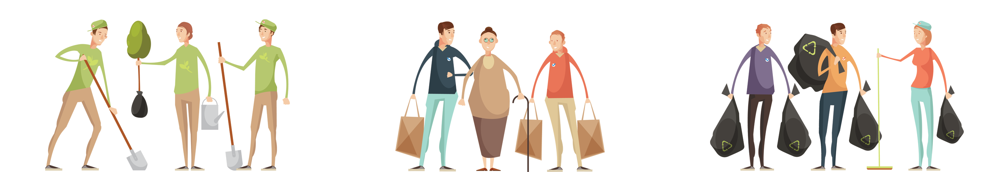
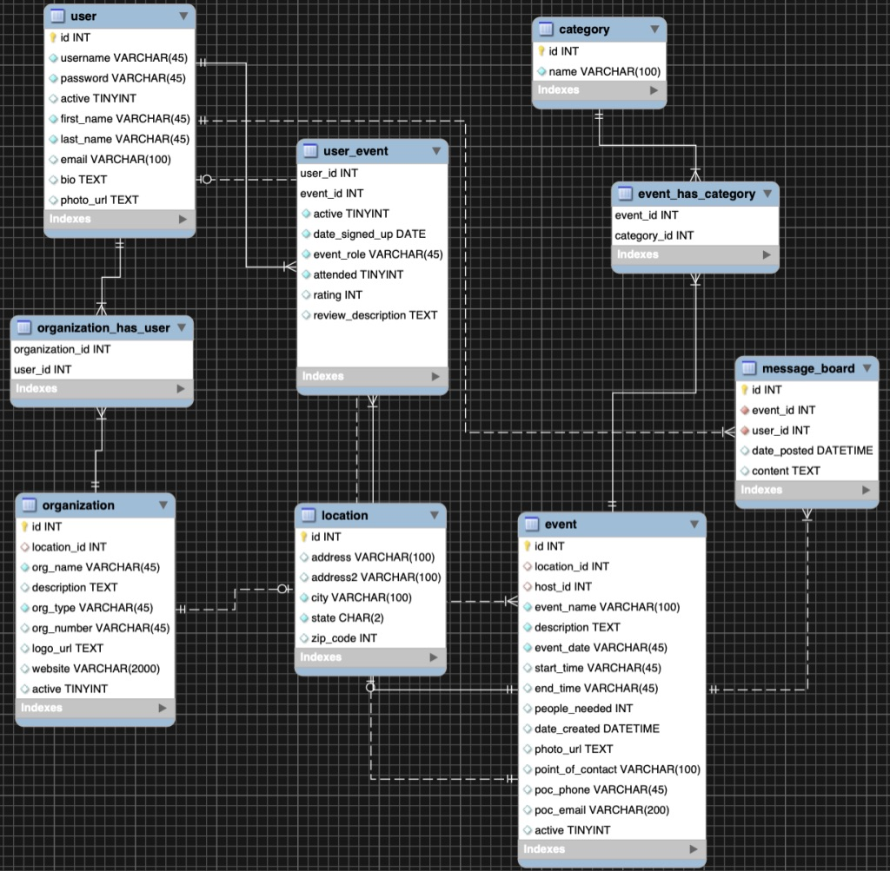

#  [goodWork](http://18.190.114.201:8080/GoodWork/index.do)
## Helping people help each other

## Mid-term Team Project for Skill Distillery (Denver, Colorado)

This is a fork of our mid term project. The original repo can be found here: https://github.com/jerryrogersjr/MidTermProject

Team Members and Roles:

* [David Norris (Developer, Scrum Master)](https://www.linkedin.com/in/david-norris-354697198/)
* [Jerry Rogers (Developer, Software Maintainer)](https://www.linkedin.com/in/jerryrogersjr/)
* [Richard Newman (Developer, Database Administrator)](https://www.linkedin.com/in/richard-n-01730b193/)

### Overview

Volunteer Connection Platform

### Description

With **goodWork**, the idea is to have a community based platform
where individuals (or individuals from organizations) can reach
out for help and/or help others in need.

Whether it's a neighborhood cleanup, helping an individual, or an
an organization, **goodWork** is intended to be a place for the
'community'.

* Register User Account
* Login to Account
* View Events or List of Events
* CRUD Events
* CRUD Organizations
* CRUD User Profile
* Search site for Events by Category, Keyword, Id, etc.
* Search site for Org's by Category, Keyword, Id, etc.
* Search and locate users in the community
* Register to Volunteer at an Event
* Unregister from an Event
* Leave Messages on the Event Message Board

### Implementation

* Design
* Database design
* Database build
* TDD
* Agile
* Stand up's
* Programming
* Continuous testing
* Constant communication
* EC2 deployment
* Mid-term (project) presentation

ERDiagram

### Technologies and Methodologies Used

* Agile
* MySQL
* Java / JUnit
* Jakarta Persistence (JPA)
* HTML
* CSS
* Bootstrap
* Git
* AWS EC2
* Spring Boot
* MySQL Workbench
* Trello
* Slack
* Atom
* MacBook Pro

### Lessons Learned

* Team Work was great!

We had a great Team. We gathered our thoughts, decided on a project,
and went through the process without any issues so we are all very
thankful for that.

* Communication

Communication was key and we stayed inter connected with a plan to
support and complement one another in all areas possible.

* Organization and Design Aspects

Our Team used basic design thinking of the user in the beginning
and build a product with that in mind. We used white board mostly
and this was very helpful in our development process. With visual
'checklists' and using the agile process, we were able to move
items very sufficiently.

* Programming

We all had out strengths and weaknesses but learning each other's
from the beginning really helped in our programming plan of
action. In the beginning we planned and developed the database
based on our initial design needs and potential needs. Once the
database was complete, we moved into developing all the essential
code, appropriate mappings, and JUnit testing. Once the all tests
were complete, we then regrouped and developed next steps. Throughout
the project, there were plenty of opportunities that were learning
experiences. Some aspects required going back to previous materials,
learing new techniques, and leaning into the abyss to try new things.
I'd have to say that testing in the beginning was likely our best
tool for success.

Now that the project has met MVP and some stretch goals, our time
is up and deployed to AWS EC2.

### Stretch Goals

 **Implemented**

* Event Categories
* Message Board

 **Not Implemented**

* User Reviews
* Google Map API
* Advanced Security
* Recent / Past Event List
* Admin Console

### Resources

* Office Space
* Coffee
* Team Internal
* Skill Distillery Learning Materials
* Instructor Support
* Google, etc.
